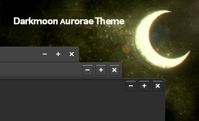

# darkmoon-kde
---------------------



<center>Darkmoon KDE</center>

## How to install ?
---------------------

``` 
git clone https://github.com/badcast/darkmoon-kde.git
```

```
cd darkmoon-kde
```
   
```
chmod +x install.sh
```
    

```
./install.sh
```


Set Themes on **systemsettings** in KDE!

Enjoy and Feel!
